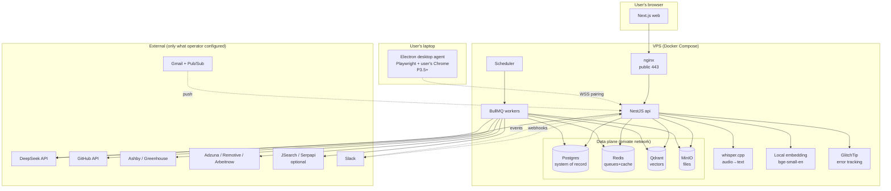
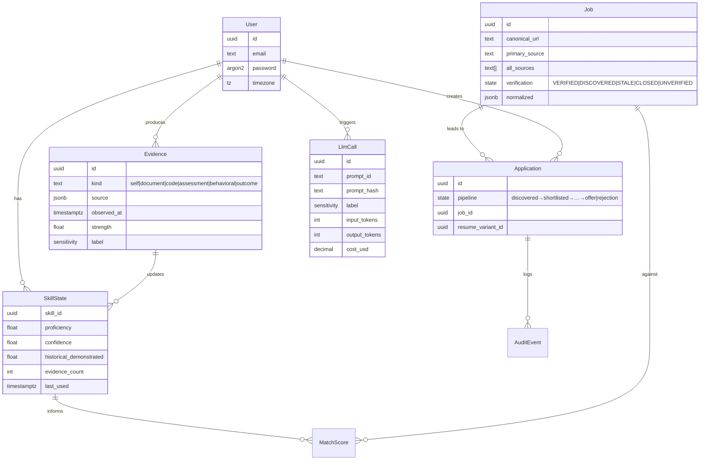
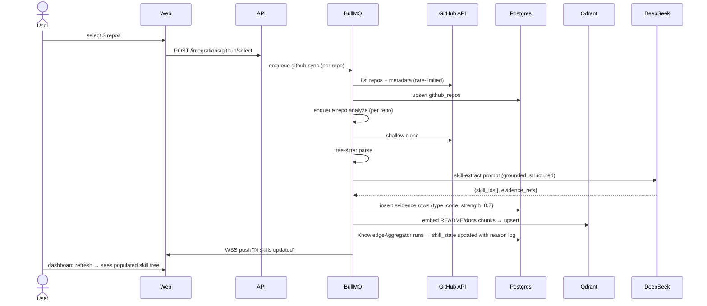
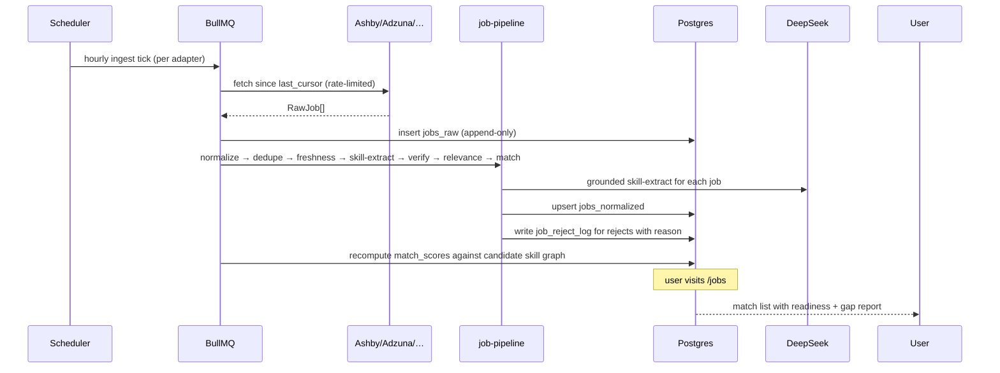
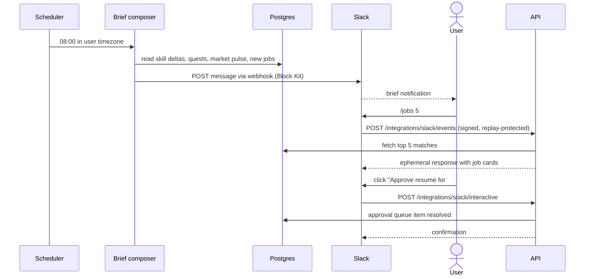

# Career OS — Architecture

The end-to-end view: what runs where, how data flows across the seven phases, and what actually happens when the user clicks a button. Complements per-phase files (`plan/phase-*.md`) which own the checklists; this doc owns the integration story.

**Audience:** anyone (human or agent) who needs to understand how the whole product fits together in one sitting.

---

## 1. What it is (one paragraph)

Career OS is a self-hosted, single-user AI career operating system. The operator runs `docker compose up` on their VPS, walks a first-run wizard, and gets a system that continuously ingests their evidence (resume, GitHub, assessments, ATS data), maintains an evidence-graph digital twin, watches the job market via APIs + a desktop agent + parsed alert emails, matches jobs against verified skills, generates fact-checked resumes/cover letters, and drives daily execution through Slack + Gmail — with every outbound action gated by an approval queue and every LLM call bounded by a sensitivity gate, cost budget, and audit log.

---

## 2. System topology



**Network policy:**
- Only nginx bound to the public interface (443 TLS, 80→443 redirect).
- Postgres, Redis, Qdrant, MinIO, whisper.cpp, embedding, GlitchTip on the private Docker network — never public.
- Workers can reach only allowlisted external domains (see `plan/security.md` Item 6).
- Agent reaches VPS only via WSS on public port; VPS never dials the agent.

---

## 3. The five entities that matter

Everything derives from these. Read once, remember forever.



**Invariants:**
- `Evidence` is append-only. Skill state is *derived* from evidence, never written directly.
- `Job` has one primary source (highest trust) + all sources retained for provenance.
- `Application` state transitions are guarded by XState; no skipping.
- Every `LlmCall` row is written by middleware — no LLM call bypasses.
- Every generated artifact (resume, cover letter, outreach, dossier) carries `evidence_refs` — nothing ships without a fact ID trail.

---

## 4. Golden-path user journeys

### 4.1 Install → dashboard (P0)

```mermaid
sequenceDiagram
    actor Op as Operator
    participant D as Docker Compose
    participant W as Web
    participant A as API
    participant P as Postgres

    Op->>D: docker compose up -d
    D->>D: startup-check (secrets, TLS, DB SSL)
    D-->>Op: all services healthy
    Op->>W: visit https://your-domain
    W->>A: GET /setup/state
    A->>P: SELECT setup_state
    P-->>A: not_started
    A-->>W: 302 /setup
    W->>Op: wizard step 1 (preflight)
    loop 14 wizard steps
        Op->>W: fill step
        W->>A: POST /setup/{step}
        A->>A: validate + capability-probe where relevant
        A->>P: persist step; advance setup_state
    end
    Op->>W: click "Enter dashboard"
    W->>A: GET /me/dashboard
    A-->>W: empty shell (P1 populates real content)
```

**What lands in the DB:** `users` (1 row, Argon2id), `provider_configs` (DeepSeek key encrypted), `integrations` (GitHub OAuth token encrypted), `resume_facts` (verified only after review), `career_goals`, `recovery_keys` (acknowledged), `setup_state` = `complete`.

**What ran externally:** DeepSeek capability probe (chat + JSON + tools + stream), Qdrant vector round-trip, GitHub OAuth exchange.

### 4.2 GitHub connect → skill state (P1)



**Data lifecycle:** repo → chunks → embeddings + AST facts → evidence rows → aggregator applies §5.4 update rules → skill state materialized with reason string logged to `skill_state_events`.

### 4.3 Job discovery → match report (P3 + P4)



**Pipeline stages** (all in `packages/job-pipeline`, source-agnostic):
1. Raw ingest (append-only)
2. Normalize to canonical schema
3. Dedupe cross-source (trust order: VERIFIED ATS > Aggregator API > Agent > Email alert)
4. Freshness gate (>45d rejected, 14–45d marked `aging`)
5. Skill extraction (grounded LLM, ESCO-normalized)
6. Verification (resolve to canonical ATS URL if possible)
7. Relevance filter (user prefs: roles, locations, comp, must-haves, dealbreakers)
8. Match score (against skill graph)
9. Land in `jobs_normalized`

Every rejected raw job writes `job_reject_log` with reason viewable in "why didn't I see this job?" UI.

### 4.4 Apply to job (P4 + P6)

```mermaid
sequenceDiagram
    actor U as User
    participant W as Web
    participant A as API
    participant ORCH as Orchestrator
    participant AG as resume-tailor agent
    participant FC as Fact-check gate
    participant AL as ATS-lint
    participant R as React-PDF+docx
    participant M as MinIO
    participant P as Postgres
    participant Q as Approval queue
    participant AGENT as Desktop agent
    participant ATS as Ashby API

    U->>W: click "Generate resume" on match
    W->>A: POST /resumes/generate {job_id}
    A->>ORCH: kickoff resume-tailor
    ORCH->>AG: (facts, job_desc, template) — sensitivity gate passed
    AG->>AG: generateGrounded → bullets with evidence_refs
    AG-->>ORCH: draft
    ORCH->>FC: verifyClaims(draft, facts)
    alt any unbacked claim
        FC-->>W: 422 with unbacked list → UI shows blocks
    else all backed
        FC-->>ORCH: ok
        ORCH->>AL: ATS-lint (single column, font, size, no tables)
        AL-->>ORCH: ok
        ORCH->>R: render PDF + DOCX
        R->>M: upload signed URLs
        ORCH->>P: insert resume_variants + evidence links
        A-->>W: 200 {variant_id, urls}
    end
    U->>W: review & approve for submission
    W->>A: POST /applications/{id}/submit
    A->>Q: enqueue approval (requiresApproval)
    U->>W: approve in queue UI
    alt ATS API supported (Ashby/Greenhouse)
        A->>ATS: submit via API (idempotency key)
        ATS-->>A: 200 + application_id
    else form-fill via agent
        A->>AGENT: WSS push task (ashby-apply script)
        AGENT->>AGENT: Playwright + user's Chrome + pacing
        AGENT->>M: upload screenshots
        AGENT-->>A: result
    end
    A->>P: application.state → applied; audit_log row
```

**Non-negotiables in this flow:**
- Sensitivity gate before LLM (blocks employer-confidential to external providers by default).
- Fact-check gate blocks any invented claim before render.
- ATS-lint blocks non-ATS-safe output.
- Approval queue before *any* submission — never auto-send.
- Audit log every action (payload + actor + IP + timestamp).

### 4.5 Daily brief → action (P5)



**Gmail companion** (parallel):
Google Pub/Sub → `POST /integrations/gmail/push` → `history.list` diff → LLM classifier (recruiter | interview | assessment | rejection | job_alert_linkedin | job_alert_indeed | job_alert_naukri | other) → fuzzy-match to open applications → land in triage or feed job pipeline (alert emails).

---

## 5. Cross-phase data lifecycles

### 5.1 A resume, from upload to generated variant

```
P0: User uploads .pdf via wizard step 09
     ↓ MinIO (sensitivity=personal, encrypted at rest)
     ↓ LLM parse (grounded) → {name, contact, experience[], education[], skills[]}
     ↓ Fact-review UI (screen 10) — user accepts/edits/rejects each fact
     ↓ Confirmed facts → resume_facts (encrypted per Item 5 in P1)
     ↓ evidence rows (type=document, strength=0.5, source_id=fact_id)

P1: KnowledgeAggregator consumes evidence
     ↓ Skill state materialized with source references

P4: User picks a match, clicks "Generate resume"
     ↓ resume-tailor agent reads resume_facts (verified only)
     ↓ generateGrounded — every bullet carries evidence_refs
     ↓ Fact-check gate verifies every specific claim maps to a fact_id
     ↓ ATS-lint checks output format
     ↓ React-PDF + docx render to MinIO
     ↓ resume_variants row (versioned, diff-able against prior)

P6: On submit, resume attached to application
     ↓ ATS API upload OR agent form-fill (approval-gated)
     ↓ audit_log row (payload + actor + IP + timestamp, append-only)
```

**Invariant:** every string in the final PDF traces back to a `resume_facts.id`. If it can't, generation was blocked.

### 5.2 A job, from raw source to application

```
P3: Adapter fetches (Ashby / Adzuna / agent / email parser)
     ↓ jobs_raw (append-only, per-source snapshot)
     ↓ Universal pipeline: normalize → dedupe → freshness → skill-extract → verify → relevance → match
     ↓ jobs_normalized with state, primary_source, all_sources[]
     ↓ Rejected rows → job_reject_log with reason
     ↓ Match score computed against skill graph (P1) using user prefs

P4: User sees match in feed
     ↓ Shortlist → company-intelligence pipeline triggered
     ↓ company_dossiers row with sourced sections
     ↓ Resume/cover-letter generated (see 5.1)
     ↓ Application state: discovered → shortlisted → resume_ready

P5: Recruiter mail matched to application via fuzzy company+role
     ↓ email_application_links; timeline updated

P6: User approves submission
     ↓ ATS API or agent form-fill
     ↓ Application state → applied → responded → interviewing → offer|rejection
     ↓ audit_log per transition
```

**Invariant:** every job in the tracker has a verification state + last-verified timestamp. Only `VERIFIED` jobs are eligible for auto-apply queue.

### 5.3 An LLM call, from user click to cost row

```
1. Domain code needs an LLM call
2. Constructs prompt via versioned template (packages/ai/prompts/*.prompt.ts)
3. Sensitivity gate inspects payload
     ↓ If employer-confidential → block or force local
     ↓ Returns allowed providers list
4. Pre-flight token estimate (js-tiktoken)
     ↓ If over per-call cap or user budget → 429
5. Provider registry picks provider
6. Wrap untrusted content (if any) via wrapUntrusted()
7. Call chatStructured<T>({schema})
8. Provider returns; Zod validates; retry once on failure
9. Middleware writes llm_calls row:
     {prompt_id, prompt_hash, sensitivity, provider, model,
      input_tokens, output_tokens, cost_usd, latency_ms,
      cache_hit, validation_pass}
10. Metrics counters bumped
11. Response bound to schema returned to caller
12. If output contains user-visible generation → fact-check gate before render
```

**Every call is auditable, budgetable, and comparable across model changes via prompt_hash.**

---

## 6. Component interactions — "what happens when…"

### …a fresh GitHub commit lands in a connected repo
- P1 `github.sync` runs on schedule (hourly)
- Detects new SHA
- Enqueues `commit.scan` job
- Tree-sitter analyzes diff
- Signals (size, style-discontinuity, AI-assist heuristics) computed
- New evidence rows written
- Aggregator recomputes affected skills
- WSS push to browser if user online

### …the user hits their monthly LLM budget
- Middleware reads `app_config.monthly_cost_limit` before dispatch
- Sums `llm_calls.cost_usd` for current month
- If exceeded: reject with 429, `Retry-After` = start of next month
- Toast in UI: "Monthly LLM budget reached. Extend in Settings → Usage & Costs."
- Kill switch never engaged unintentionally

### …the desktop agent goes offline mid-task
- Server WSS ping fails → device marked `disconnected`
- All in-flight tasks for that device marked `held`
- On reconnect: agent replays `held` tasks; server dedupes via task_id
- If agent never reconnects: tasks stay `held` for 7d, then auto-cancel; user sees notification

### …an email arrives with a prompt-injection payload
- Gmail push → new message fetched
- Body wrapped via `wrapUntrusted(content, "email")`
- `injection-scan` regex + LLM classifier scores
- High score → marked `SUSPECTED_INJECTION`
- Classifier still runs but no auto-action taken
- User sees flag in triage UI with snippet + score + recommended action

### …the operator rotates the master ENCRYPTION_KEY
- **Implemented.** `POST /me/security/rotate-key` (session + fresh re-auth).
  Fresh re-auth uses `SensitivityGateService.hasFreshReauth(userId,
  'security.rotate_master_key')`, same window the passkey / password re-verify
  path mints via `withReauthWindow` (C-P0.3).
- Body: `{ "newKey": "<64 hex chars or 44 base64 chars>" }`. The service calls
  `assertStrongKey` (rejects missing / known-weak / short) then `loadMasterKey`
  (strict format) before touching a single row. The old key is the process's
  current `ENCRYPTION_KEY`; the new key is never persisted by the endpoint.
- Walk (`MasterKeyRotationService.rotate`): every `encrypted_secrets` row
  (AAD context = its `purpose`), then every `enc:v1:`-prefixed `ENCRYPTED_FIELDS`
  column (`ResumeFact.content`, `LlmHallucinationLog.snippet`,
  `Evidence.detail`, `Application.notes`, `OutreachMessage.body/subject`, AAD
  context = column name). Reads/writes go through the **unextended**
  `PrismaService.rawClient` so stored ciphertext is touched verbatim, not
  decrypted/re-encrypted with the env key by the field-encryption extension.
- **One transaction per row** (`$transaction` around each `update`); the pure
  `rotateMasterKey(oldKey, newKey, ctx)` in `@careeros/secrets` decides per
  value: decrypts with old → re-encrypts with new; if only the new key
  decrypts, the row is already rotated and is skipped (idempotent resume);
  plaintext legacy field values pass through untouched.
- **On failure**: the walk stops at the first row neither key decrypts and
  returns `{ scanned, rotated, alreadyRotated, skippedPlaintext, failed,
  stopped: true, failure: { source, id, message } }` (never any
  secret/ciphertext). The operator therefore keeps the old `ENCRYPTION_KEY`,
  fixes the reported row and re-runs the endpoint — already-rotated rows are
  skipped, so the run resumes.
- **On success** (`stopped: false`): the operator replaces the `ENCRYPTION_KEY`
  env value with the new key and restarts the stack. The endpoint only reports
  progress; it never writes env.

### …nightly backup runs
- Compose cron sidecar at 03:00 UTC
- `scripts/backup.sh`: `pg_dump -Fc` + Qdrant snapshot + MinIO rsync → tar → `age` encrypt → ship to configured destination
- Retention: 7 daily + 4 weekly + 12 monthly
- Metrics: `backup_size_bytes`, `backup_duration_seconds`, success/fail counter
- On fail: GlitchTip alert
- CI weekly job restores latest backup into fresh volumes, boots API, verifies `setup_state = complete` + row-count parity

### …a match report needs company intelligence
- User shortlists a job
- `company.enrich` job enqueued
- Fetches: identity + business (site, Wikipedia, Crunchbase public), tech signals (blog RSS + public GitHub), reviews (AmbitionBox + Comparably + Reddit/Blind), interview signals, recent events
- Every source rate-limited per `packages/shared/rate-limits.ts`
- `dossier-synthesizer` agent builds structured dossier, grounded per fact
- Cached 30d; user can force-refresh
- UI shows every claim with source chip + fetch date

### …the user asks to delete all their data (GDPR-style)
- Settings → Data & Privacy → Delete everything
- Fresh re-auth required
- Confirmation dialog with typed username
- One transaction: delete rows across every user-owned table
- Revoke all sessions, agent devices, OAuth tokens
- MinIO objects deleted
- audit_log retains the deletion event itself (compliance)
- Response 200 → user signed out

---

## 7. Service topology (containers)

| Service | Image | Public? | Volumes | Depends on |
|---|---|---|---|---|
| nginx | `nginx:alpine` (digest `sha256:df221db8…`) | 80/443 | local certs, `letsencrypt`, `certbot-www` | api, web |
| web | `careeros/web` (distroless node20) | private 3000 | — | api |
| api | `careeros/api` (distroless node20) | private 3001 | — | postgres, redis, qdrant, minio |
| worker | `careeros/worker` (distroless node20) | none | — | redis, postgres, qdrant, minio |
| scheduler | `careeros/worker --schedule` | none | — | redis |
| postgres | `postgres:16` (pinned) | private 5432 | `pgdata` | — |
| redis | `redis:7-alpine` (pinned) | private 6379 | `redisdata` | — |
| qdrant | `qdrant/qdrant` (pinned) | private 6333 | `qdrantdata` | — |
| minio | `minio/minio` (pinned) | private 9000 | `miniodata` | — |
| embedding | `careeros/embedding` (bge-small-en) | private 4000 | model cache | — |
| whisper | built from `infra/docker/Dockerfile.whisper` (whisper.cpp v1.9.4, `small.en`; `speech` profile) | private 4001 | `whisperdata` model cache | — |
| glitchtip | `glitchtip/glitchtip:6.2.6` (digest `sha256:a3d8eb1b…`; `ops`/`observability` profile) | private 8000 | `glitchtipdata` | postgres, redis |
| backup | built from `infra/docker/Dockerfile.backup` (age + busybox cron; `ops` profile) | none | `backupdata` | postgres, minio, qdrant |
| certbot | `certbot/certbot` (digest `sha256:f70ad0ad…`) | none | `letsencrypt`, `certbot-www` | — |

**nginx routing (config: `infra/nginx/`).** nginx is the only service that
publishes host ports. It terminates TLS (HSTS + security headers), redirects
`:80` to `:443` except `/healthz` and the ACME challenge, and routes `/` to
`web:3000`, `/api/*` to `api:3001` (the `/api` prefix is stripped because the
api's controllers are unprefixed). Local dev uses a self-signed cert from
`infra/nginx/self-signed.sh` with `HSTS_MAX_AGE=0`; production points
`TLS_CERT_PATH`/`TLS_KEY_PATH` at the `letsencrypt` volume after
`certbot certonly`. The `certbot` service renews every 12h.

**Backup sidecar.** The `backup` service is profile-gated (`profiles: [ops]`)
so it does not start with the normal stack; `docker compose --profile ops up -d
backup` runs `scripts/backup-cron.sh` nightly, writing age-encrypted artifacts
to the `backupdata` volume. It requires `AGE_RECIPIENT` from `.env` (see
`docs/backup.md`).

All non-nginx services on private Docker network. Volumes are named (not bind mounts) for portability.

---

## 8. Failure modes & degradation

| Failure | Behavior |
|---|---|
| DeepSeek unreachable | Circuit breaker after 5 fails → fallback to configured backup provider (Ollama last-resort). UI shows "degraded" badge. Non-blocking work continues. |
| Postgres down | API returns 503 with clear message. Retry loop on health check every 5s. |
| Qdrant down | Search returns empty with warning; text-based fallback where possible; embedding queue backs up but doesn't lose data. |
| MinIO down | New uploads fail with 503; existing artifacts unaffected. |
| Redis down | Queues stop; API rate limits fall back to in-memory (single-replica ok). |
| Agent offline | Server queues tasks for 7 days; if never reconnects, cancel with user notification. |
| LLM budget exceeded | Every LLM call returns 429 with reset time. Kill switch is separate — user can still `/pause` explicitly. |
| Provider validation retry-exhausted | Log to `llm_hallucination_log`, return 502 to caller, user sees "generation failed, retry?" |
| Backup fails | GlitchTip alert; audit_log entry; next-day backup still runs (no state carried across). |
| Restore-test fails in CI | Merge blocked; on-call notified via GitHub. |
| Selector broken on allowlisted domain | Domain marked `stale`, auto-apply disabled, user notified, agent falls back to "open in browser + clipboard paste" |
| Injection detected in incoming content | Auto-action skipped; user reviews in triage |
| Rate limit hit on external adapter | Exponential backoff per AGENTS.md §Retry; user sees `aging` label on job list if ingestion lags |

---

## 9. FAQ

**Q: Where's the source of truth for X?**
A: Postgres for structured data. Qdrant for vectors. MinIO for files. Redis for transient state. The LLM is *never* the source of truth. Provider APIs are inference dependencies, not stores.

**Q: How do I add a new job source?**
A: Implement `JobSourceAdapter` interface in `packages/job-pipeline/adapters/<name>/`. Add rate limit to `packages/shared/rate-limits.ts`. Register in adapter registry. Add fixtures + tests. Never scrape without authorization; use partner API or the desktop agent.

**Q: How do I add a new LLM provider?**
A: Implement `AIProvider` interface in `packages/ai/providers/<name>/`. Add pricing to `packages/ai/pricing.ts`. Register in provider registry. Capability probe runs automatically in wizard.

**Q: How do I add a new assessment type?**
A: Add runner in `packages/assessment/runners/<type>/`. Define rubric YAML if needed. Register in assessment registry. Add golden eval set.

**Q: Where does the desktop agent run Playwright — server or laptop?**
A: Laptop only, using the user's installed Chrome and their real logged-in session. Server sends tasks over WSS; laptop executes; results stream back.

**Q: What's the difference between `historical_demonstrated_proficiency` and `current_readiness`?**
A: Historical = best evidence ever recorded (never decays). Current readiness = recency-adjusted (decays without use). A candidate can have demonstrated Kubernetes ability 2 years ago but be rusty today. Both facts matter.

**Q: When is a generated resume rejected?**
A: Any of: unbacked claim (fact-check gate), non-ATS-safe format (linter), sensitivity gate blocked upstream LLM call, output schema validation failed after one retry, over budget (429).

**Q: What's the smallest failing test I need to add for feature X?**
A: For non-trivial logic (branch, loop, parser, money/security path): one `assert`-based test that fails if the logic breaks. See AGENTS.md §Testing conventions.

**Q: How does the system stay fresh on jobs I've already seen vs new ones?**
A: `jobs_raw.fetched_at` + `jobs_normalized.first_seen_at, last_verified_at`. Freshness worker revalidates active jobs; state moves to `STALE` or `CLOSED` accordingly. UI sorts by "new to you" via `first_seen_at > user.last_visit`.

**Q: What happens on version upgrade?**
A: `docker compose pull && docker compose up -d`. Migrations run on API boot in a transaction. See `plan/release-process.md` for the upgrade contract; every release ships a changelog entry with breaking changes at top.

**Q: How is the audit log tamper-proof?**
A: MVP: append-only, no update/delete permissions granted to app DB role. v1.1+: hash-chain per row + `scripts/audit-verify.sh`. Decision recorded in `phase-6-controlled-execution.md`.

**Q: Where do I look when something breaks?**
A: `docker compose logs api` (pino JSON). GlitchTip UI for errors. `/metrics` for counters. Health page for service status. See `plan/observability.md`.

---

## 10. Related docs

- `AGENTS.md` — rules for agents writing code in this repo
- `plan/PLAN.md` — master implementation plan + decisions + status
- `plan/phase-N-*.md` — per-phase checklists
- `plan/security.md` — 10 security items with acceptance criteria
- `plan/ai-safety.md` — hallucination / injection / agent boundaries / evals
- `plan/observability.md` — logs / metrics / errors / health
- `plan/release-process.md` — semver / signing / SBOM / changelog
- `docs/dev-setup.md` — from clone to running instance in 10 minutes
- `docs/*.docx` — original blueprint (v1.2 authoritative)

*If this doc drifts from reality — update it. It's the one place that shows how the whole thing fits.*
