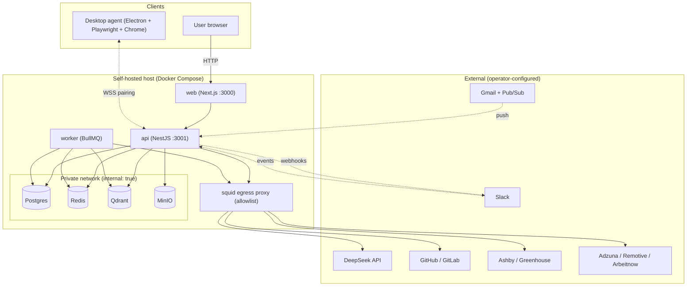
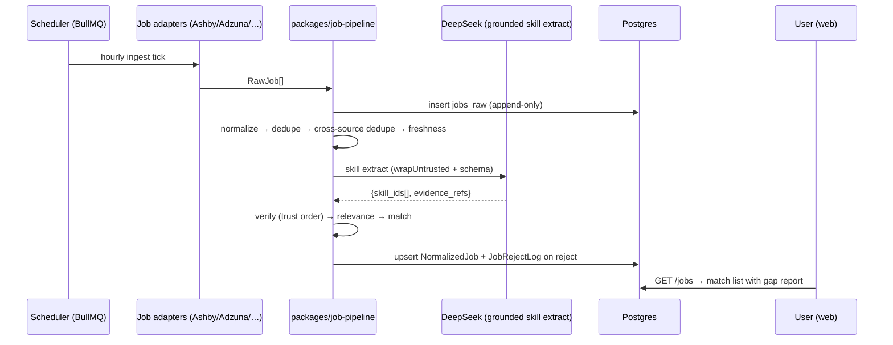

# Architecture

Career OS is a layered, modular monolith plus async workers and a local desktop agent. Postgres is the source of truth; LLMs never are (`AGENTS.md` §1, `docs/architecture.md` §9).

## Core Sections (Required)

### 1) Architectural Style

- **Primary style:** layered + feature-modular monolith (`apps/api` NestJS modules over a Prisma data layer), with an event/queue side-car (`apps/worker` + BullMQ) and an out-of-process agent (`apps/desktop`).
- **Why this classification (evidence):** `apps/api/src/app.module.ts:14-124` registers 38 feature modules plus infra modules (`PrismaModule`, `StorageModule`, `QueueModule`, `SensitivityGateModule`, `MetricsModule`); each module owns controller + service + Prisma access. `apps/worker/src/main.ts` boots independent queue consumers. `packages/*` hold capability interfaces consumed by both.
- **Primary constraints (evidence):**
  1. **Evidence over claims** — Postgres evidence graph is authoritative; LLMs interpret only (`AGENTS.md` §1, §11).
  2. **Privacy/egress control** — server scraping of LinkedIn/Indeed/Naukri/Glassdoor is prohibited; only partner APIs, the user's own agent session, or parsed email alerts (`AGENTS.md` §3.4, §15).
  3. **Approval + audit for outbound actions** — nothing sends without an approval-queue item and an append-only audit row (`AGENTS.md` §3.3, `apps/api/src/modules/approvals/`).

### 2) System Flow

```text
Browser (Next.js) → middleware setup-gate → /api HTTP (NestJS controllers)
  → domain service (modules/*) → packages/* capability (ai, job-pipeline, secrets…)
  → Postgres / Qdrant / Redis / MinIO  → response
Async: API enqueues BullMQ job → apps/worker processor → external API
  → Postgres evidence/pipeline rows → (optionally) WSS push back to browser
```

Concretely, a GitHub connect (`docs/architecture.md` §4.2): web `POST /integrations/github/select` → API enqueues `github.sync` → worker lists repos via Octokit → evidence rows → KnowledgeAggregator updates `candidate_skill_state` and appends `skill_state_event` → dashboard reads `/me/skills`.

An LLM call (`docs/architecture.md` §5.3): build versioned prompt → sensitivity gate → provider registry → `chatStructured<T>({schema})` → Zod validation (one retry) → `llm_calls` audit row → optional fact-check gate before rendering.

### 3) Layer/Module Responsibilities

| Layer or module | Owns | Must not own | Evidence |
|-----------------|------|--------------|----------|
| `apps/web` | Routing, middleware gate, feature components, browser fetch/CSRF | Adapter imports, server secrets | `apps/web/src/middleware.ts`, `apps/web/src/lib/api-client.ts` |
| `apps/api/modules/*` | HTTP/WS endpoints, domain rules, state machines, Prisma access | Provider SDK calls, long batch jobs | `apps/api/src/modules/` |
| `apps/api/common` | Guards, pipes, filters, storage, metrics, redaction | Feature domain logic | `apps/api/src/common/` |
| `apps/worker` | Queue processors, cron jobs, external sync | HTTP handling | `apps/worker/src/*.worker.ts`, `main.ts` |
| `apps/desktop` | Local Playwright, keychain, WSS, OS integration | Server business logic, server-side scraping | `apps/desktop/src/main.ts`, `task-runner.ts` |
| `packages/ai` | Provider abstraction, prompts, grounding, injection/sensitivity | DB writes | `packages/ai/src/provider.ts`, `providers/deepseek.ts` |
| `packages/job-pipeline` | Source-agnostic ingestion stages + adapters | Persistence (caller writes) | `packages/job-pipeline/src/stages/`, `adapters/` |
| `packages/shared` | Zod schemas, constants, knowledge rules, retry, redact, SSRF guard | Feature-specific logic | `packages/shared/src/` |

### 4) Reused Patterns

| Pattern | Where found | Why it exists |
|---------|-------------|---------------|
| Provider/Adapter (Strategy) | `packages/ai/src/provider.ts` + `registry.ts`; `packages/job-pipeline/src/adapters/`; `packages/embeddings/src/qdrant.ts` | Swap LLM/job source without touching domain code |
| Registry (explicit, no FS scan) | `ProviderRegistry`, prompt registry `packages/ai/src/prompts/index.ts`, adapter registry | Predictable boot; unknown ID = hard fail |
| Repository/Service via DI | All `apps/api/src/modules/*.service.ts` + PrismaService | Keep invariant enforcement in one layer |
| State machine | `apps/api/src/modules/approvals/state-machine.ts`; `packages/shared/src/applications.ts` (`canTransition`) | Guard irreversible transitions |
| Queue + idempotent job IDs | `apps/worker/src/main.ts`, `packages/shared/src/queues.ts` | Reliable async; no double-processing |
| Zod at trust boundaries | `apps/api/src/common/pipes/zod-validation.pipe.ts`; every prompt schema | Validate every request + LLM response |
| Grounded generation | `packages/ai/src/grounded.ts` + `grounded/gate.ts`; fact-check in `resume-variants` | Every generated claim binds to a `fact_id` |
| Untrusted-content isolation | `packages/ai/src/wrap.ts` + `injection-scan.ts` | Structural prompt-injection defence |
| Field-level encryption via middleware | `apps/api/src/prisma/prisma.service.ts:28-116` | Encrypt PII at rest transparently |
| Guard/decorator | `RequireAdminGuard`, `@RateLimitAuth()`, `AgentJwtGuard` | Cross-cutting auth/limits |

### 5) Known Architectural Risks

- **Multi-user not enforced by default.** Most modules call `SessionService.requireUserId`, but there is no global session guard; global `AppConfig` writes are explicitly blocked when a second user exists (`UsageService.assertSingleUserForGlobalConfig`, `plan/security.md` item 1). A missed `requireUserId` could expose data before multi-tenant work lands. See `CONCERNS.md`.
- **Schema is string-typed, not enum-enforced.** 55 Prisma models, 0 `enum` blocks — states are `String` with documented unions (`Application.state`, `Evidence.kind`, `NormalizedJob.state`). Invalid states are only prevented by app code.
- **Placeholder embedding + single LLM provider** mean semantic search and provider-agnosticism are not yet real (`packages/embeddings/src/local.ts`, `packages/ai/src/providers/`).
- **Two Prisma major versions across workspaces** (`@prisma/client ^6.19.3` in api vs `^5.20.0` in worker) risk schema/client drift.
- **N+1 / pagination ceiling** already identified by the team: `plan/PLAN.md:69` parks N+1 in `JobsService.sync` and a match-score pagination pool ceiling as debt.
- **Deferred phase slices** (see `plan/DEFERRED.md`) mean several documented flows are partial; `[TODO]` surfaces referenced in docs may not exist.

### 6) Evidence

- `docs/architecture.md` (system topology, golden paths, data lifecycles, failure modes)
- `AGENTS.md` §1-§14, `plan/PLAN.md` (locked decisions, status board)
- `apps/api/src/main.ts`, `apps/api/src/app.module.ts`, `apps/api/src/modules/`
- `apps/worker/src/main.ts`, `packages/ai/src/{provider,registry,grounded,wrap}.ts`
- `apps/api/prisma/schema.prisma`

## Extended Sections

### Component / deployment architecture



### Data flow: job ingestion to match (source-agnostic)



### Failure modes / degraded behaviour

The repo documents its degradation posture in `docs/architecture.md` §8: DeepSeek circuit-breaker to fallback provider; Postgres down → 503 + retry loop; Qdrant down → text fallback; Redis down → in-memory rate limit; agent offline → tasks held 7 days; LLM budget exceeded → 429 with reset time; injection detected → auto-action skipped. The observability contract adds `/health` (dependency checks, 5s cache) and `/metrics` (`plan/observability.md`).
