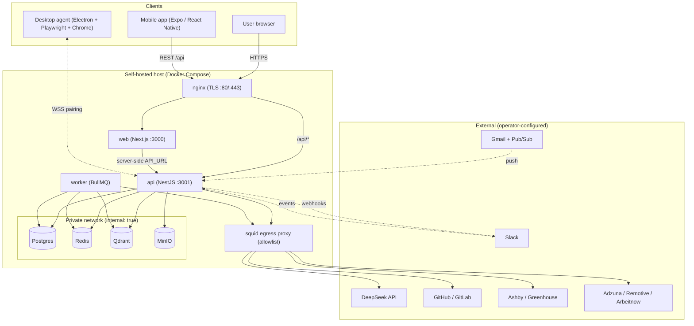
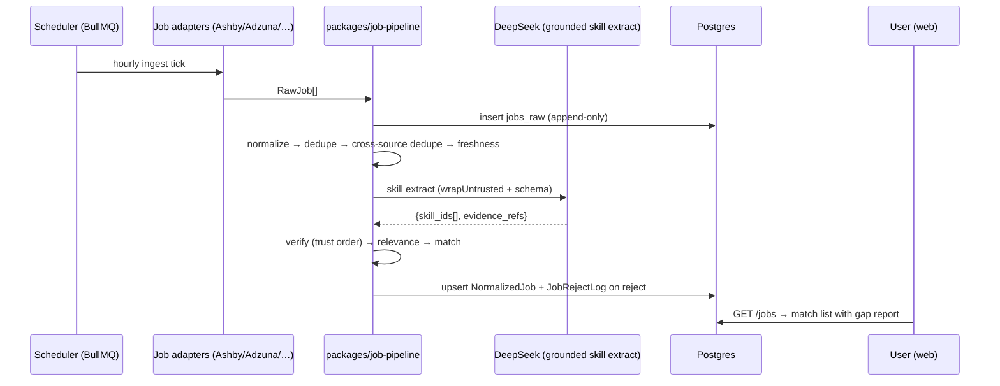

# Architecture

Career OS is a layered, modular monolith plus async workers, a local desktop agent, and an Expo mobile client. Postgres is the source of truth; LLMs never are (`AGENTS.md` §1, `docs/architecture.md` §9).

## Core Sections (Required)

### 1) Architectural Style

- **Primary style:** layered + feature-modular monolith (`apps/api` NestJS modules over a Prisma data layer), with an event/queue side-car (`apps/worker` + BullMQ), an out-of-process agent (`apps/desktop`), and a thin REST mobile client (`apps/mobile`).
- **Why this classification (evidence):** `apps/api/src/app.module.ts` registers 50 modules — 43 feature modules plus infra (`PrismaModule`, `StorageModule`, `QueueModule`, `SensitivityGateModule`, `ProviderLoaderModule`, `InjectionAuditModule`, `MetricsModule`); each feature module owns controller + service + Prisma access. `apps/worker/src/main.ts` boots independent queue consumers via the shared `registerWorker` helper. `packages/*` hold capability interfaces consumed by both apps; `apps/mobile` is standalone and talks REST only.
- **Single sources of truth (post-cleanup):** job-match scoring lives once in `packages/job-pipeline/src/stages/match.ts` (`computeMatch` for detail, `computeMatchResult` for the jobs list); provider construction + fallback goes through `ProviderLoaderService` (`apps/api/src/common/provider-loader.service.ts`); sensitivity policy has one authority, `SensitivityGateService` (`apps/api/src/common/sensitivity-gate.service.ts`) over the pure rank primitives in `@careeros/ai`; skill-state sync is `@careeros/aggregator`; embeddings go through one `EmbeddingProvider` seam (`packages/embeddings/src/provider.ts`) and one secret-aware config resolver, `loadResolvedEmbeddingConfig` (`packages/embeddings/src/config.ts`), so API search, the worker, and Qdrant collection dimension agree on `app_config` beats `EMBEDDING_MODE`; master-key rotation is the pure `rotateMasterKey` primitive (`packages/secrets/src/rotation.ts`) driven by `MasterKeyRotationService`; outreach approval lifecycle is a registered `ApprovalsWorker` (`OutreachService.onApproved`) that only stages a Gmail draft on human approval, with the delayed `outreach-send` queue flushing it. Approval dispatch for an unhandled kind fails loud (audit + `markFailed`) rather than dropping the item.
- **Primary constraints (evidence):**
  1. **Evidence over claims** — Postgres evidence graph is authoritative; LLMs interpret only (`AGENTS.md` §1, §11).
  2. **Privacy/egress control** — direct server (first-party) scraping of LinkedIn/Indeed/Naukri/Glassdoor is prohibited, as are non-Firecrawl third-party scrapers; owner decision 2026-10-06 permits accessing them **via Firecrawl** (discovery + scrape), alongside partner APIs, the user's own agent session, and parsed email alerts (`AGENTS.md` §3.4, §15).
  3. **Approval + audit for outbound actions** — nothing sends without an approval-queue item and an append-only audit row (`AGENTS.md` §3.3, `apps/api/src/modules/approvals/`).

### 2) System Flow

```text
Browser (Next.js) → middleware setup-gate → /api HTTP (NestJS controllers)
  → domain service (modules/*) → packages/* capability (ai, job-pipeline, secrets…)
  → Postgres / Qdrant / Redis / MinIO  → response
Nginx (TLS :443) → / → web:3000 · /api/* → api:3001 (prefix stripped)
Expo mobile app → same REST API (mobile:* bearer, no cookie)
Async: API enqueues BullMQ job → apps/worker processor → external API
  → Postgres evidence/pipeline rows → (optionally) WSS push back to browser
```

Concretely, a GitHub connect (`docs/architecture.md` §4.2): web `POST /integrations/github/select` → API enqueues `github.sync` → worker lists repos via Octokit → evidence rows → KnowledgeAggregator updates `candidate_skill_state` and appends `skill_state_event` → dashboard reads `/me/skills`.

A resume commit (`POST /resume/confirm` → `ResumeService.commit`) writes `resume_facts`, then rebuilds the resume side of the same graph: each verified `skill` fact is resolved to a catalogue `Skill` id (`apps/api/src/modules/skills/skill-name-resolver.ts`) and written as an idempotent `Evidence` row (`kind=document`, `signal=presence`, `sourceRef.kind=resume_fact`) before `syncSkillState` folds it into `candidate_skill_state` (`apps/api/src/modules/resume/resume-skill-graph.ts`). The same commit fire-and-forget calls `JobPreferencesService.deriveFromResume` to fill blank job-preference fields (roles/locations/seniority/must-have skills) from the resume; `POST /me/job-preferences/derive-from-resume` exposes it to the Settings panel.

An LLM call (`docs/architecture.md` §5.3): build versioned prompt → sensitivity gate → provider fallback chain → `chatStructured<T>({schema})` → Zod validation (one retry) → `llm_calls` audit row → optional fact-check gate before rendering. Untrusted content that trips the wrap/scan boundary additionally writes a `llm_injection_log` row.

### 3) Layer/Module Responsibilities

| Layer or module | Owns | Must not own | Evidence |
|-----------------|------|--------------|----------|
| `apps/web` | Routing, middleware gate, feature components, browser fetch/CSRF | Adapter imports, server secrets | `apps/web/src/middleware.ts`, `apps/web/src/lib/api-client.ts` |
| `apps/api/modules/*` | HTTP/WS endpoints, domain rules, state machines, Prisma access | Provider SDK calls, long batch jobs | `apps/api/src/modules/` |
| `apps/api/common` | Guards, pipes, filters, storage, metrics, redaction | Feature domain logic | `apps/api/src/common/` |
| `apps/worker` | Queue processors, cron jobs, external sync | HTTP handling | `apps/worker/src/*.worker.ts`, `main.ts` |
| `apps/desktop` | Local Playwright, keychain, WSS, OS integration | Server business logic, server-side scraping | `apps/desktop/src/main.ts`, `task-runner.ts` |
| `apps/mobile` | Read-only mobile UI, secure-store token, REST calls | Server business logic, write actions | `apps/mobile/src/app/`, `apps/mobile/src/lib/api.ts` |
| `packages/ai` | Provider abstraction + DeepSeek/OpenAI-compatible/Ollama adapters + fallback chain, prompts, tokenizer, grounding, injection/sensitivity | DB writes | `packages/ai/src/provider.ts`, `providers/` |
| `packages/job-pipeline` | Source-agnostic ingestion stages + adapters; the canonical weighted match scorer (`computeMatch`/`computeMatchResult`) | Persistence (caller writes) | `packages/job-pipeline/src/stages/`, `stages/match.ts`, `adapters/` |
| `packages/aggregator` | Skill-state aggregation + `skill_state_event` audit (type-only Prisma) | HTTP / domain rules | `packages/aggregator/src/index.ts` |
| `packages/firecrawl` | Firecrawl search/scrape/crawl client (Zod-validated, typed errors) | Job-source policy (lives in `docs/job-sources.md`) | `packages/firecrawl/src/client.ts` |
| `packages/embeddings` | Qdrant store + provider seam (local/deterministic/external) + `app_config` config resolver + dynamic collection dims | Feature/domain logic; key storage (caller seals/decrypts) | `packages/embeddings/src/` |
| `packages/messaging` | `Channel` interface + `ChannelRegistry` + pure RFC 822 MIME builder | Prisma/HTTP/transport SDK | `packages/messaging/src/` |
| `packages/browser-agent` | Declarative apply `apply_flow` engine + per-site scripts + forbidden-selector guard | Server/business logic | `packages/browser-agent/src/scripts/apply-flow.ts` |
| `packages/shared` | Zod schemas, constants, knowledge rules, retry, redact, SSRF guard, egress proxy, collection registry | Feature-specific logic | `packages/shared/src/` |

### 4) Reused Patterns

| Pattern | Where found | Why it exists |
|---------|-------------|---------------|
| Provider/Adapter (Strategy) | `packages/ai/src/provider.ts` + `registry.ts` + `providers/`; `packages/embeddings/src/provider.ts`; `packages/job-pipeline/src/adapters/`; `packages/embeddings/src/qdrant.ts` | Swap LLM/embedding/job source without touching domain code |
| Decorator fallback chain | `packages/ai/src/providers/fallback.ts` + `CircuitBreaker` (primary → backup → Ollama) | Availability failover without changing call sites; gate runs per candidate |
| Bounded fire-and-forget audit queue | `apps/api/src/common/llm-audit.ts` (`makeLlmAuditor`), `apps/api/src/common/injection-log.ts` | Persist `llm_calls` + `llm_injection_log` without blocking or unbounded memory |
| Single-loader / single-authority | `ProviderLoaderService` (budget → config → sensitivity → decrypt → construct provider), `SensitivityGateService` (one egress decision per provider) | Remove near-duplicate call-site logic and divergent policy |
| Canonical pure scorer | `packages/job-pipeline/src/stages/match.ts` — same `computeMatch` backs list + detail | One score per job/candidate pair |
| Registry (explicit, no FS scan) | `ProviderRegistry`, prompt registry `packages/ai/src/prompts/index.ts`, adapter registry | Predictable boot; unknown ID = hard fail |
| Approval-worker callback | `OutreachService implements ApprovalsWorker` and `registerWorker(this)` with `ApprovalsModule` (`apps/api/src/modules/outreach/outreach.service.ts`) | Outbound actions stay gated; approval flips to a staged side effect |
| DB-resolved config, fail-loud | `packages/embeddings/src/config.ts` (`loadResolvedEmbeddingConfig`): `app_config` beats env; `external` without config throws instead of degrading | One effective embedding identity across API + worker; no silent vector-space poisoning |
| Declarative multi-step flow | `packages/browser-agent/src/scripts/apply-flow.ts` driven by YAML `apply_flow` (`loader.ts`) | Site changes are data edits; selector drift reported, EEO fields guarded |
| Repository/Service via DI | All `apps/api/src/modules/*.service.ts` + PrismaService | Keep invariant enforcement in one layer |
| State machine | `apps/api/src/modules/approvals/state-machine.ts`; `packages/shared/src/applications.ts` (`canTransition`) | Guard irreversible transitions |
| Queue + idempotent job IDs | `apps/worker/src/main.ts`, `packages/shared/src/queues.ts` | Reliable async; no double-processing |
| Zod at trust boundaries | `apps/api/src/common/pipes/zod-validation.pipe.ts`; every prompt schema | Validate every request + LLM response |
| Grounded generation | `packages/ai/src/grounded.ts` + `grounded/gate.ts`; fact-check in `resume-variants` | Every generated claim binds to a `fact_id` |
| Untrusted-content isolation | `packages/ai/src/wrap.ts` + `injection-scan.ts` | Structural prompt-injection defence |
| Field-level encryption via middleware | `apps/api/src/prisma/prisma.service.ts:28-116` | Encrypt PII at rest transparently |
| Guard/decorator | `RequireAdminGuard`, `@RateLimitAuth()`, `AgentJwtGuard` | Cross-cutting auth/limits |

### 5) Known Architectural Risks

- **Multi-user not enforced by default.** Most modules call `SessionService.requireUserId`, but there is no global session guard; global `AppConfig` writes are explicitly blocked when a second user exists (`UsageService.assertSingleUserForGlobalConfig`, `plan/security.md` item 1). A missed `requireUserId` could expose data before multi-tenant work lands. See `CONCERNS.md`.
- **Schema is string-typed, not enum-enforced.** 57 Prisma models, 0 `enum` blocks — states are `String` with documented unions (`Application.state`, `Evidence.kind`, `NormalizedJob.state`, `VerbalSession.status`). Invalid states are only prevented by app code.
- **Anthropic/Azure have no adapter** (DeepSeek, OpenAI/OpenRouter, and Ollama do, with a real fallback chain), and circuit-breaker state is in-process (`packages/ai/src/providers/`, `apps/api/src/common/provider-loader.service.ts`).
- **N+1 / pagination ceiling** already identified by the team: `plan/PLAN.md:69` parks N+1 in `JobsService.sync` and a match-score pagination pool ceiling as debt. Skill extraction and adapter fetch/persist still run inline in the API request path rather than on a `jobs` BullMQ queue.
- **Deferred phase slices** (see `plan/DEFERRED.md`) mean several documented flows are partial: the P6 talk-track practice consumer and verbal-recording retention sweep, web `@sentry/nextjs` instrumentation, mobile push/offline, desktop installer signing, and prompt-eval registration are still open. The P2 `verbal_sessions` table + endpoints + whisper grading + grader agent ship in the assessments module. GlitchTip and `whisper.cpp` now exist in compose (profiles `ops`/`observability` and `speech`), and the formerly-absent deployment paths (`infra/nginx/`, `infra/docker/Dockerfile.backup`) exist.
- **Resolved during cleanup + Waves A–C + `feat/remaining-work` (no longer risks):** Prisma is aligned on 6.x across api/worker/aggregator; egress for Node global `fetch` is enforced via `undici`; Swagger/OpenAPI is implemented; api/worker/web containers are hardened; GitHub Actions are SHA-pinned; the embedding provider seam is real (`bge-small-en` + deterministic fallback + a shipped OpenAI-compatible external adapter with DB-resolved dims and an encrypted key); `@careeros/messaging` is instantiated through `ChannelRegistry` and now builds outbound MIME; the desktop devices UI ships; nginx/TLS/certbot/backup are in compose; the web backlog routes/components, Gmail outbound, real Slack command/event/interactive services, the outreach approval lifecycle + `outreach-send` worker, repository analysis, active-session management, and browser-agent multi-step apply flows are wired. See `CONCERNS.md`.

### 6) Evidence

- `docs/architecture.md` (system topology, golden paths, data lifecycles, failure modes)
- `AGENTS.md` §1-§14, `plan/PLAN.md` (locked decisions, status board)
- `apps/api/src/main.ts`, `apps/api/src/app.module.ts`, `apps/api/src/modules/`
- `apps/api/src/common/{provider-loader.service.ts,sensitivity-gate.service.ts,llm-audit.ts,injection-log.ts,injection-audit.module.ts}`, `packages/job-pipeline/src/stages/match.ts`, `packages/aggregator/src/index.ts`, `packages/embeddings/src/{provider,external,config,qdrant}.ts`, `apps/worker/src/embedding-job.ts`, `packages/secrets/src/rotation.ts`, `apps/api/src/modules/me/master-key-rotation.service.ts`
- `apps/worker/src/main.ts`, `apps/worker/src/register-worker.ts`, `apps/worker/src/outreach-send.worker.ts`, `packages/ai/src/{provider,registry,grounded,wrap}.ts`, `packages/ai/src/providers/`
- `apps/api/src/modules/{outreach,slack,gmail,repository-analysis}/`, `apps/api/src/modules/auth/session.controller.ts`, `packages/messaging/src/mime.ts`, `packages/browser-agent/src/scripts/apply-flow.ts`
- `apps/mobile/src/`, `apps/desktop/src/`, `apps/web/src/components/AppNav.tsx`, `infra/nginx/`, `infra/docker/Dockerfile.backup`
- `apps/api/prisma/schema.prisma`

## Extended Sections

### Component / deployment architecture



### Data flow: job ingestion to match (source-agnostic)



### Failure modes / degraded behaviour

The repo documents its degradation posture in `docs/architecture.md` §8: DeepSeek circuit-breaker to fallback provider; Postgres down → 503 + retry loop; Qdrant down → text fallback; Redis down → in-memory rate limit; agent offline → tasks held 7 days; LLM budget exceeded → 429 with reset time; injection detected → auto-action skipped. The observability contract adds `/health` (dependency checks, 5s cache) and `/metrics` (`plan/observability.md`).
