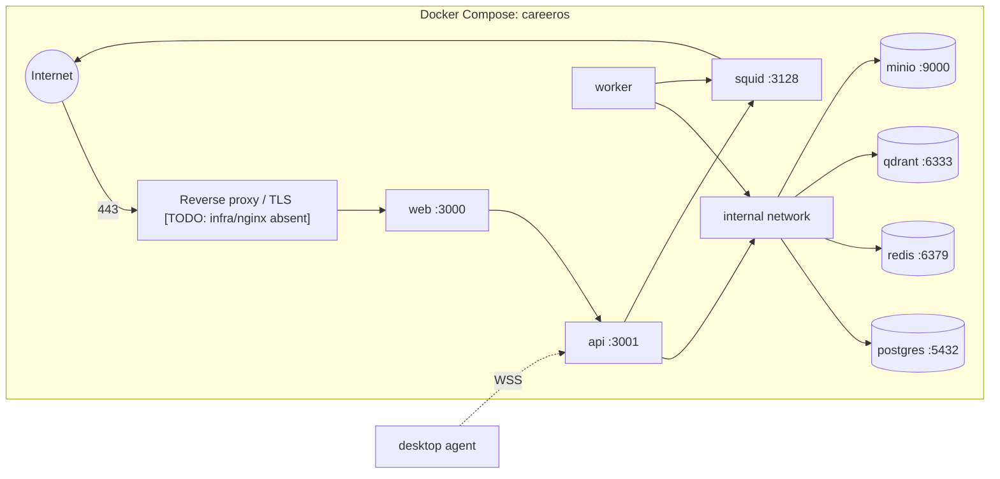
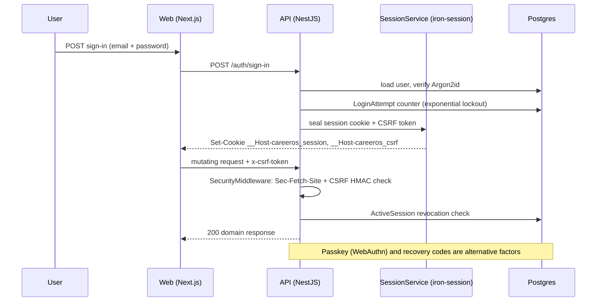

# External Integrations

Career OS integrates with LLM, code-host, job-source, messaging, and email systems — all behind a deny-by-default egress proxy. Datastores run on a private Docker network.

## Core Sections (Required)

### 1) Integration Inventory

| System | Type | Purpose | Auth model | Criticality | Evidence |
|--------|------|---------|------------|-------------|----------|
| DeepSeek API | HTTP (OpenAI-compatible) | Primary LLM: skill extract, grading, resume/cover-letter, market brief, dossier, email classify | Per-install API key, encrypted at rest | High | `packages/ai/src/providers/deepseek.ts`, `packages/ai/src/pricing.ts` |
| GitHub | REST (Octokit) | Repo list + sync, commit analysis for skill evidence | PAT (OAuth optional); scope-gated to `repo`/`public_repo`/`read:user`/`user:email` | High | `apps/worker/src/github-sync.ts`, `apps/api/src/modules/integrations/github/github.service.ts` |
| GitLab | REST | Public + self-hosted repo sync (PAT) | PAT + per-user host allowlist via `assertPublicUrl` | Medium | `apps/worker/src/gitlab-sync.ts`, `packages/shared/src/net/assert-public-url.ts` |
| Ashby / Greenhouse | ATS REST | Verified job source (highest trust tier) + ATS submission | Public boards (no auth); submission via API later | High | `packages/job-pipeline/src/adapters/`, `apps/api/src/modules/ats-submit/adapters/` |
| Adzuna / Remotive / Arbeitnow | Aggregator REST | Aggregator job sources (tier 2) | API key (Adzuna) / none | Medium | `packages/job-pipeline/src/adapters/`; `plan/PLAN.md:20` |
| JSearch / Serpapi (optional) | Paid partner API | LinkedIn/Indeed via legitimate partners | API key | Low (optional) | `plan/PLAN.md:20`, `docs/architecture.md` §2 |
| Slack | Web API + Events API | Daily brief, slash commands, interactive approvals | OAuth bot token + request signing (HMAC) | Medium | `apps/api/src/modules/slack/`, `infra/slack/manifest.yml` |
| Gmail | Google OAuth + Pub/Sub | Email alert ingest, inbox triage | OAuth `gmail.readonly` + watch/push | Medium | `apps/api/src/modules/gmail/`, `apps/worker/src/gmail-watch-renewal.worker.ts` |
| Qdrant | Vector DB | Semantic search over verified/user content | Private network, no public auth in MVP | Medium | `packages/embeddings/src/qdrant.ts` |
| MinIO | Object storage | Resumes, generated artifacts, agent screenshots | Root credentials + per-user signed URLs | High | `apps/api/src/common/storage.service.ts`, `infra/docker/docker-compose.yml` |
| Squid | Forward proxy | Deny-by-default egress allowlist | Network policy | High | `infra/docker/squid/squid.conf` |
| GlitchTip | Error tracking (Sentry-compatible) | Self-hosted error capture | DSN (planned wiring) | Low | `plan/observability.md`; `[TODO]` not in compose yet |
| Desktop agent | WSS | Server→laptop task execution, pairing | Device-code pairing → JWT + refresh, OS keychain | Medium | `apps/desktop/src/wss-client.ts`, `apps/api/src/modules/agent/` |

### 2) Data Stores

| Store | Role | Access layer | Key risk | Evidence |
|-------|------|--------------|----------|----------|
| Postgres 16 | System of record (55 models, 38 migrations, append-only `jobs_raw`/`audit_events`/`llm_calls`) | Prisma (`apps/api`, `apps/worker`) | Two Prisma majors across workspaces; AppConfig not yet user-scoped | `apps/api/prisma/schema.prisma`, `apps/api/package.json`, `apps/worker/package.json` |
| Redis 7 | BullMQ queues, throttler store, cache | `ioredis`, BullMQ | Queue loss if Redis down (documented degradation) | `apps/worker/src/main.ts`, `apps/api/src/modules/auth/auth.module.ts` |
| Qdrant | Vector index (semantic content) | `@qdrant/js-client-rest` via `QdrantStore` | Embeddings are a placeholder today | `packages/embeddings/src/local.ts`, `src/qdrant.ts` |
| MinIO | Files (resumes, PDFs, screenshots) | `minio` SDK wrapped in `StorageService` | Credentials must be strong; presign TTL 5 min | `apps/api/src/common/storage.service.ts` |
| Local filesystem (agent) | Playwright profile, screenshots, logs | `keytar`, `fs` | Screenshot/log retention bounded to 30d/10MB/14d | `apps/desktop/src/screenshot-cleanup.ts`, `log-rotation.ts` |

### 3) Secrets and Credentials Handling

- **Credential sources:** environment variables for boot/master secrets (`ENCRYPTION_KEY`, `SESSION_SECRET`, datastore passwords) and AES-256-GCM-encrypted DB rows for per-integration secrets (`EncryptedSecret`, `Integration`, `ProviderConfig`). Master key must be 64-char hex or 44-char base64 (`packages/secrets/src/master-key.ts`); field encryption uses HKDF subkeys with AAD context (`packages/secrets/src/field.ts`).
- **Hardcoding checks:** `.gitleaks.toml` + `gitleaks.yml` CI + lefthook pre-commit; `startup-check.ts` refuses known-weak values (`careeros`, `minioadmin`, `changeme`, …) and <24-byte datastore creds.
- **Rotation lifecycle:** master `ENCRYPTION_KEY` rotation flow is described (`docs/architecture.md` §6) as decrypt-all → re-encrypt-all with fresh re-auth; not yet proven by an end-to-end test. OAuth tokens stored encrypted; GitHub PAT scope validation rejects over-broad/`admin:*` scopes (`github.service.ts:55`).

### 4) Reliability and Failure Behavior

- **Retry/backoff:** shared `packages/shared/retry.ts` — exponential with full jitter, base 500ms, factor 2, max 30s, 3 attempts; `429` honours `Retry-After`; non-429 `4xx` fails fast; circuit breaker at 5 consecutive failures per (provider, endpoint), 60s open, half-open probe (`AGENTS.md` §6).
- **Timeout policy:** DeepSeek provider enforces `max_tokens` (default 4096) and SSRF-guarded fetches; health checks use 500ms per dependency with a 5s cache (`plan/observability.md`); agent navigation timeout 30s (`apps/desktop/src/task-runner.ts`).
- **Circuit-breaker/fallback:** documented in `docs/architecture.md` §8 (DeepSeek → fallback provider → Ollama last-resort). `[TODO]` Only DeepSeek adapter exists, so the real fallback path is not implemented.
- **Egress control:** api/worker force `HTTP(S)_PROXY=http://squid:3128` with `NO_PROXY` for datastores; Squid denies by default and allows only deepseek/openai/anthropic/openrouter/github/githubusercontent/gitlab/npmjs/github-releases; denies non-80/443, CONNECT≠443, and local IPs (`infra/docker/squid/squid.conf`).
- **SSRF gate:** `assertPublicUrl` (DNS-resolved, redirect-revalidated, host allowlist) applies to user-supplied provider/embedding base URLs and self-hosted GitLab (`packages/shared/src/net/assert-public-url.ts`).

### 5) Observability for Integrations

- **Logging around external calls:** yes — `pino`, with `provider`/`model`/`prompt_id`/`prompt_hash`/`job_id`/`duration_ms` context (`plan/observability.md`).
- **Metrics:** `prom-client` `/metrics` on api + worker, including `llm_*`, `queue_*`, `jobs_*`, `agent_*`, and auth counters. `[TODO]` worker `/metrics` wiring and GlitchTip service are not yet present in `docker-compose.yml`.
- **Missing visibility gaps:** no tracing in MVP (interface reserved); no GlitchTip compose service; `llm_calls` middleware is only partially done (per-call caps shipped, full table/middleware deferred per `plan/ai-safety.md` item 9).

### 6) Evidence

- `packages/ai/src/providers/deepseek.ts`, `packages/ai/src/pricing.ts`
- `packages/job-pipeline/src/adapters/`, `packages/email-parsers/src/senders/allowlist.ts`
- `apps/api/src/modules/integrations/`, `apps/api/src/modules/{slack,gmail,agent}/`
- `infra/docker/docker-compose.yml`, `infra/docker/squid/squid.conf`, `infra/slack/manifest.yml`
- `.env.example`, `packages/secrets/src/`, `packages/shared/src/net/assert-public-url.ts`
- `plan/security.md` items 4, 6, 8, 10; `plan/observability.md`; `docs/architecture.md` §2, §7, §8

## Extended Sections

### Deployment topology

### Authentication sequence (browser session + CSRF)

### Integration contract tests

Every job-source adapter has a recorded-fixture contract test (`packages/job-pipeline/src/adapters/*.contract.test.ts`) and a weekly live revalidation workflow (`.github/workflows/adapter-contract.yml`). Adzuna is fully MSW-mocked because its upstream requires paid credentials.
