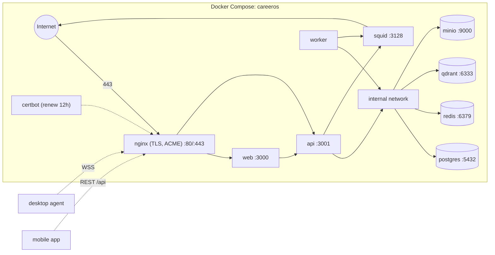

# External Integrations

Career OS integrates with LLM, code-host, job-source, messaging, and email systems — all behind a deny-by-default egress proxy. Datastores run on a private Docker network, and nginx is the single public TLS entrypoint.

## Core Sections (Required)

### 1) Integration Inventory

| System | Type | Purpose | Auth model | Criticality | Evidence |
|--------|------|---------|------------|-------------|----------|
| DeepSeek API | HTTP (OpenAI-compatible) | Default LLM: skill extract, grading, resume/cover-letter, market brief, dossier, email classify | Per-install API key, encrypted at rest | High | `packages/ai/src/providers/deepseek.ts`, `packages/ai/src/pricing.ts` |
| OpenAI / OpenRouter / any OpenAI-compatible | HTTP | Alternate/backup LLM providers via one `openai-compatible.ts` adapter | Encrypted API key + optional per-user base URL (SSRF-gated) | Medium | `packages/ai/src/providers/openai-compatible.ts`, `create.ts` |
| Ollama (local) | HTTP (`/api/chat`) | Last-resort local LLM fallback; never leaves the host | Local endpoint, no key | Low | `packages/ai/src/providers/ollama.ts` |
| External embeddings (OpenAI-compatible) | HTTP (`POST {baseUrl}/embeddings`) | Optional semantic embeddings against OpenAI/Azure/OpenRouter/Together/vLLM/gateways instead of local `bge-small-en` | Per-install base URL + API key (sealed with `packages/secrets`); expected dimension required | Medium | `packages/embeddings/src/{external,config}.ts`, `apps/api/src/modules/embeddings/embeddings.service.ts` |
| GitHub | REST (Octokit) | Repo list + sync, commit analysis for skill evidence | PAT (OAuth optional); scope-gated to `repo`/`public_repo`/`read:user`/`user:email` | High | `apps/worker/src/github-sync.ts`, `apps/api/src/modules/integrations/github/github.service.ts` |
| GitLab | REST | Public + self-hosted repo sync (PAT) | PAT + per-user host allowlist via `assertPublicUrl` | Medium | `apps/worker/src/gitlab-sync.ts`, `packages/shared/src/net/assert-public-url.ts` |
| Ashby / Greenhouse | ATS REST | Verified job source (highest trust tier) + ATS submission | Public boards (no auth); submission via API later | High | `packages/job-pipeline/src/adapters/`, `apps/api/src/modules/ats-submit/adapters/` |
| Workday / Lever / SmartRecruiters / Workable / iCIMS / SuccessFactors | ATS/career-site adapters | Direct crawl of public company career sites and ATS boards (owner decision U6) | Public boards; config/credentials per source (env) | Medium–High | `packages/job-pipeline/src/adapters/{workday,lever,smartrecruiters,workable,icims,successfactors}/` |
| Firecrawl | Managed scrape/search/crawl (`api.firecrawl.dev/v1`) | Public career-site / ATS discovery, preferred over direct crawl | `FIRECRAWL_API_KEY` (optional; encrypted at rest) | Medium | `packages/firecrawl/src/client.ts`, `packages/job-pipeline/src/adapters/firecrawl/`, `docs/job-sources.md` |
| Adzuna / Remotive / Arbeitnow | Aggregator REST | Aggregator job sources (tier 2) | API key (Adzuna) / none | Medium | `packages/job-pipeline/src/adapters/`; `plan/PLAN.md:20` |
| JSearch / Serpapi (optional) | Paid partner API | LinkedIn/Indeed via legitimate partners | API key | Low (optional) | `plan/PLAN.md:20`, `docs/architecture.md` §2 |
| Slack | Web API + Events API | Daily brief, real slash commands (`/quiz` `/jobs` `/brief` `/approve` `/review` `/pause` `/resume`), events (`app_mention`/DM), interactive Block Kit approvals; webhooks rate-limited 120/min | OAuth bot token + request signing (HMAC) | Medium | `apps/api/src/modules/slack/{slack.commands,slack.events,slack.interactive,slack.context}.service.ts`, `infra/slack/manifest.yml` |
| Gmail | Google OAuth + Pub/Sub | Email alert ingest, inbox triage, and outbound drafts/sends/replies for outreach | OAuth `gmail.readonly` + `gmail.compose`; watch/push | Medium | `apps/api/src/modules/gmail/{gmail.outbound.service.ts,gmail.auth.ts}`, `packages/messaging/src/mime.ts`, `apps/worker/src/gmail-watch-renewal.worker.ts` |
| Qdrant | Vector DB | Semantic search over verified/user content | Private network, no public auth in MVP | Medium | `packages/embeddings/src/qdrant.ts` |
| MinIO | Object storage | Resumes, generated artifacts, agent screenshots | Root credentials + per-user signed URLs | High | `apps/api/src/common/storage.service.ts`, `infra/docker/docker-compose.yml` |
| Squid | Forward proxy | Deny-by-default egress allowlist | Network policy | High | `infra/docker/squid/squid.conf` |
| nginx | Reverse proxy + TLS | Public entrypoint: terminates TLS, ACME HTTP-01, routes `/`→web, `/api/*`→api (prefix stripped) | Network policy; self-signed or Let's Encrypt cert | High | `infra/nginx/nginx.conf`, `infra/nginx/templates/careeros.conf.template` |
| certbot | ACME client | Renews issued Let's Encrypt certs every 12h into the shared volume | `ACME_EMAIL`; operator issues first cert | Medium | `infra/docker/docker-compose.yml` (certbot service) |
| GlitchTip | Error tracking (Sentry-compatible) | Self-hosted error capture (all-in-one, profile `ops`/`observability`) | `SENTRY_DSN`/`GLITCHTIP_DSN`; blank = SDK no-op | Low | `apps/api/src/common/sentry.ts`, `apps/worker/src/sentry.ts`, `docs/observability.md`, `infra/docker/docker-compose.yml` |
| whisper.cpp | Local speech-to-text HTTP server | P2 verbal defense + P6 talk-track transcription (profile `speech`) | Private network via `WHISPER_URL`; blank = client inert | Medium | `packages/stt/`, `infra/docker/Dockerfile.whisper`, `docs/stt.md` |
| Desktop / mobile clients | WSS + REST | Desktop agent pairing/execution; mobile read-only companion | Device-code pairing → JWT + refresh; `expo-secure-store`/keychain | Medium | `apps/desktop/src/wss-client.ts`, `apps/mobile/src/lib/auth.tsx`, `apps/api/src/modules/{agent,mobile}/` |

### 2) Data Stores

| Store | Role | Access layer | Key risk | Evidence |
|-------|------|--------------|----------|----------|
| Postgres 16 | System of record (57 models, 41 migrations, append-only `jobs_raw`/`audit_events`/`llm_calls`/`llm_injection_log`; new `verbal_sessions`) | Prisma 6 (`apps/api`, `apps/worker`, `@careeros/aggregator`) | AppConfig not yet user-scoped (multitenant TODO) | `apps/api/prisma/schema.prisma`, `apps/api/prisma/migrations/20261013020000_verbal_sessions/`, `apps/api/package.json`, `apps/worker/package.json`, `packages/aggregator/package.json` |
| Redis 7 | BullMQ queues, throttler store, cache | `ioredis`, BullMQ | Queue loss if Redis down (documented degradation) | `apps/worker/src/main.ts`, `apps/api/src/modules/auth/auth.module.ts` |
| Qdrant | Vector index (semantic content); collection dimension follows the effective provider and **recreates on a dimension change** (`recreateOnMismatch`, logging a re-embed notice) | `@qdrant/js-client-rest` via `QdrantStore` | Vectors are semantic when the resolved mode is `local`/`external`; pre-switch vectors are deterministic/stale and need re-embedding | `packages/embeddings/src/{provider.ts,external.ts,config.ts,qdrant.ts}`, `apps/worker/src/embedding-job.ts` |
| MinIO | Files (resumes, PDFs, screenshots) | `minio` SDK wrapped in `StorageService` | Credentials must be strong; presign TTL 5 min | `apps/api/src/common/storage.service.ts` |
| Local filesystem (agent) | Playwright profile, screenshots, logs | `keytar`, `fs` | Screenshot/log retention bounded to 30d/10MB/14d | `apps/desktop/src/screenshot-cleanup.ts`, `log-rotation.ts` |

### 3) Secrets and Credentials Handling

- **Credential sources:** environment variables for boot/master secrets (`ENCRYPTION_KEY`, `SESSION_SECRET`, datastore passwords) and AES-256-GCM-encrypted DB rows for per-integration secrets (`EncryptedSecret`, `Integration`, `ProviderConfig`). The **external embedding API key** is likewise sealed with `packages/secrets` (purpose `embedding.externalApiKey`) into `app_config`, never returned to the client (the API exposes only `hasApiKey`), and a legacy plaintext value is migrated to a seal on first read (`apps/api/src/modules/embeddings/embeddings.service.ts`). Master key must be 64-char hex or 44-char base64 (`packages/secrets/src/master-key.ts`); field encryption uses HKDF subkeys with AAD context (`packages/secrets/src/field.ts`).
- **Hardcoding checks:** `.gitleaks.toml` + `gitleaks.yml` CI + lefthook pre-commit; `startup-check.ts` refuses known-weak values (`careeros`, `minioadmin`, `changeme`, …) and <24-byte datastore creds.
- **Rotation lifecycle:** master `ENCRYPTION_KEY` rotation is **implemented** (Wave C). `POST /me/security/rotate-key` (session + fresh re-auth via `SensitivityGateService.hasFreshReauth`) runs `MasterKeyRotationService`, which walks every `encrypted_secrets` row and every `enc:v1:`-prefixed `ENCRYPTED_FIELDS` value one transaction per row using the pure, idempotent `rotateMasterKey` primitive (`packages/secrets/src/rotation.ts`). It stops at the first row neither key can decrypt and reports `{scanned, rotated, alreadyRotated, skippedPlaintext, failed, failure}` without ever returning ciphertext; re-running resumes. On success the operator updates `ENCRYPTION_KEY` and restarts (the endpoint never writes env). OAuth tokens stored encrypted; GitHub PAT scope validation rejects over-broad/`admin:*` scopes (`github.service.ts:55`).

### 4) Reliability and Failure Behavior

- **Retry/backoff:** shared `packages/shared/retry.ts` — exponential with full jitter, base 500ms, factor 2, max 30s, 3 attempts; `429` honours `Retry-After`; non-429 `4xx` fails fast; circuit breaker at 5 consecutive failures per (provider, endpoint), 60s open, half-open probe (`AGENTS.md` §6).
- **Timeout policy:** DeepSeek provider enforces `max_tokens` (default 4096) and SSRF-guarded fetches; health checks use 500ms per dependency with a 5s cache (`plan/observability.md`); agent navigation timeout 30s (`apps/desktop/src/task-runner.ts`).
- **Circuit-breaker/fallback:** implemented (DeepSeek/OpenAI-compatible → configured backup → Ollama last-resort) in `packages/ai/src/providers/fallback.ts` + `apps/api/src/common/provider-loader.service.ts`; 5 consecutive availability failures → 60s open → half-open probe, with a `providerStatus` degraded badge. Circuit state is in-process (move to Redis for multi-replica).
- **Rate limiting:** Slack webhooks are capped at 120 req/min before the HMAC verify (`slack.controller.ts`), Gmail draft/send at 30/min, session mutations at 20/min (`RateLimitSessions`), OAuth/credential routes at 5/min. The `outreach-send` BullMQ worker runs concurrency 2 + `limiter {max:5, duration:1000}` — far under Gmail's 250 quota-units/sec/user. External embeddings use the shared retry policy (429 + 5xx retry; other 4xx and shape/dimension errors fail fast).
- **Egress control:** api/worker force `HTTP(S)_PROXY=http://squid:3128` with `NO_PROXY` for datastores; Squid denies by default and allows only deepseek/openai/anthropic/openrouter/github/githubusercontent/gitlab/npmjs/github-releases plus **`api.firecrawl.dev`**; denies non-80/443, CONNECT≠443, and local IPs (`infra/docker/squid/squid.conf`). Direct ATS/career-site crawl hosts are deliberately **not** wildcarded — each reviewed host needs an explicit `allowed_dsts` line (`docs/job-sources.md`). Because Node global `fetch` ignores proxy env vars, `installEgressProxy()` (`packages/shared/src/net/proxy-dispatcher.ts`) installs an undici `EnvHttpProxyAgent` at api/worker boot (`apps/api/src/main.ts:97`, `apps/worker/src/main.ts:120`) and fails closed if the proxy is configured but cannot be built (`docs/egress.md`). A manual operator smoke lives at `scripts/smoke/egress.sh` (not run in CI; the live Docker egress smoke is still outstanding).
- **SSRF gate:** `assertPublicUrl` (DNS-resolved, redirect-revalidated, host allowlist) applies to user-supplied provider/embedding base URLs and self-hosted GitLab (`packages/shared/src/net/assert-public-url.ts`).

### 5) Observability for Integrations

- **Logging around external calls:** yes — `pino`, with `provider`/`model`/`prompt_id`/`prompt_hash`/`job_id`/`duration_ms` context (`plan/observability.md`).
- **Metrics:** `prom-client` `/metrics` on api + worker, including `llm_*`, `queue_*`, `jobs_*`, `agent_*`, and auth counters. `[TODO]` worker `/metrics` wiring is still pending; the GlitchTip error-tracking service and `whisper.cpp` speech service now exist in `docker-compose.yml` (profiles `ops`/`observability` and `speech`).
- **Per-call LLM + injection audit are wired:** `makeLlmAuditor` (`apps/api/src/common/llm-audit.ts`) is passed into the provider via `ProviderLoaderService`, so each call writes one `LlmCall` (`llm_calls`: prompt id/hash, sensitivity, tokens — `js-tiktoken` pre-flight estimate + provider `usage` — cost split, latency, validation verdict) through a bounded drop-loudly queue and emits metrics. `InjectionAuditModule` installs wrap/scan hooks so every suspect/blocked hit also writes one `LlmInjectionLog` (`llm_injection_log`). Outbound messaging writes an `audit_events` row per transition (`outreach.approval.requested`, `outreach.approval.draft_created|failed`, `outreach.sent`) and Slack commands/interactions likewise audit. Remaining gaps: no tracing in MVP (interface reserved); worker `/metrics` not wired; tokenizer/pricing coverage still maturing (`plan/ai-safety.md` item 9).

### 6) Evidence

- `packages/ai/src/providers/`, `packages/ai/src/pricing.ts`, `apps/api/src/common/{llm-audit.ts,injection-log.ts}`, `packages/ai/src/tokenize.ts`
- `packages/job-pipeline/src/adapters/`, `packages/firecrawl/src/client.ts`, `packages/email-parsers/src/senders/allowlist.ts`, `docs/job-sources.md`
- `apps/api/src/modules/integrations/`, `apps/api/src/modules/{slack,gmail,agent,mobile,outreach}/`, `packages/messaging/src/mime.ts`, `apps/worker/src/outreach-send.worker.ts`
- `infra/docker/docker-compose.yml`, `infra/nginx/`, `infra/docker/Dockerfile.backup`, `infra/docker/squid/squid.conf`, `scripts/smoke/egress.sh`, `infra/slack/manifest.yml`
- `.env.example`, `packages/secrets/src/` (incl. `rotation.ts`), `apps/api/src/modules/me/master-key-rotation.service.ts`, `packages/shared/src/net/{assert-public-url,proxy-dispatcher}.ts`
- `packages/embeddings/src/{provider,external,config,qdrant}.ts`, `apps/worker/src/embedding-job.ts`, `apps/api/src/modules/{embeddings,search}/`
- `apps/api/src/modules/auth/session.controller.ts`, `apps/api/src/modules/repository-analysis/`
- `plan/security.md` items 4, 6, 8, 10; `plan/observability.md`; `docs/architecture.md` §2, §7, §8

## Extended Sections

### Deployment topology



### Authentication sequence (browser session + CSRF)

```mermaid
sequenceDiagram
    participant U as User
    participant W as Web (Next.js)
    participant A as API (NestJS)
    participant S as SessionService (iron-session)
    participant DB as Postgres

    U->>W: POST sign-in (email + password)
    W->>A: POST /auth/sign-in
    A->>DB: load user, verify Argon2id
    A->>DB: LoginAttempt counter (exponential lockout)
    A->>S: seal session cookie + CSRF token
    S-->>W: Set-Cookie __Host-careeros_session, __Host-careeros_csrf
    W->>A: mutating request + x-csrf-token
    A->>A: SecurityMiddleware: Sec-Fetch-Site + CSRF HMAC check
    A->>DB: ActiveSession revocation check
    A-->>W: 200 domain response
    Note over A,DB: Passkey (WebAuthn) and recovery codes are alternative factors; GET/DELETE /auth/sessions manage active sessions
```

### Integration contract tests

Every job-source adapter has a recorded-fixture contract test (14 `*.contract.test.ts` across `packages/job-pipeline/src/adapters/**` and `apps/api/src/modules/ats-submit/adapters/**`) and a weekly live revalidation workflow (`.github/workflows/adapter-contract.yml`). The ATS set now includes `firecrawl`, `workday`, `lever`, `smartrecruiters`, `workable`, `icims`, and `successfactors` alongside `ashby`, `greenhouse`, `adzuna`, `arbeitnow`, and `remotive`. Adzuna is fully MSW-mocked because its upstream requires paid credentials; several ATS adapters are live-validated in the weekly run.
