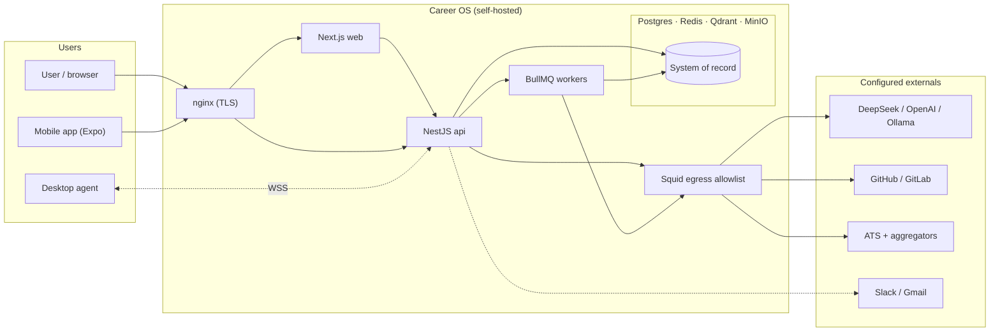

# Career OS — Knowledge Base

An evidence-based reference for engineers working on **Career OS** — a self-hosted, provider-agnostic Personal AI Career Operating System. Built from the repository at revision `d31dead` (2026-10-03), after Waves A–C (desktop UI, Expo mobile, OSS-AGPL, embeddings/providers, deploy/nginx, AI-safety logs, key rotation).

## Executive summary

Career OS is a single-user-by-default, multi-user-ready **pnpm + Turborepo monorepo** (~112k lines of TypeScript across 5 apps and 15 packages), licensed **AGPL-3.0-or-later**. A Next.js 16 web app, a NestJS 10 API, an Expo (React Native) mobile companion, and an Electron + Playwright desktop agent sit in front of **Postgres (system of record), Redis (queues), Qdrant (vectors), and MinIO (files)**; BullMQ workers do asynchronous ingestion/sync; nginx is the single public TLS entrypoint. The AI layer is a `packages/ai` provider abstraction with real DeepSeek, OpenAI/OpenRouter-compatible, and local Ollama adapters plus a primary→backup→Ollama fallback chain; every LLM call passes a sensitivity gate, produces schema-validated output, is grounded in the Postgres evidence graph, and is audited to `llm_calls`, with a dedicated `llm_injection_log`. Embeddings now use a real local `bge-small-en` model (`@xenova/transformers`) with a deterministic offline fallback. Job discovery includes the `@careeros/firecrawl` client and Workday/Lever/SmartRecruiters/Workable/iCIMS/SuccessFactors adapters for public career sites and ATS boards.

The product's non-negotiable invariants (`AGENTS.md` §3): evidence (not LLM claims) is truth; generated content may only rephrase verified facts; every outbound action needs approval + audit; server-side scraping of LinkedIn/Indeed/Naukri/Glassdoor is prohibited; every job flows through one ingestion pipeline; and data carries sensitivity labels.

**Maturity:** alpha, pre-v0.1. Every phase P0-P6 is "In progress" with named shipped slices and named deferrals (`plan/PLAN.md`). The web surface is owned by a parallel workstream (see `CHANGELOG.md` Notes). Treat unchecked items in `plan/*.md` as not-done.

## Documents

| Document | What it answers |
|----------|-----------------|
| [STACK.md](STACK.md) | Languages, runtimes, frameworks, dependency reality checks, commands, env |
| [STRUCTURE.md](STRUCTURE.md) | Directory map, entry points, module boundaries, naming rules, workspace graph |
| [ARCHITECTURE.md](ARCHITECTURE.md) | Style, system flow, layer responsibilities, patterns, risks, diagrams |
| [CONVENTIONS.md](CONVENTIONS.md) | Naming, formatting/lint, imports, errors/logging, testing rules |
| [INTEGRATIONS.md](INTEGRATIONS.md) | External APIs, data stores, secrets, reliability, observability, deployment |
| [TESTING.md](TESTING.md) | Frameworks, layout, scope matrix, mocking, CI gates, gaps |
| [CONCERNS.md](CONCERNS.md) | Prioritised risks, debt, security, performance, churn, and `[ASK USER]` items |
| [PUBLIC_OVERVIEW.md](PUBLIC_OVERVIEW.md) | Plain-language product overview for a general audience |

## How to use this knowledge base

- **New to the repo?** Read this page, then `ARCHITECTURE.md`, then `STRUCTURE.md`. Keep `AGENTS.md` and `plan/PLAN.md` open beside it — they are the team's own durable spec and status board.
- **About to change code?** Check `CONVENTIONS.md` and `TESTING.md` first; both cite the binding source files.
- **Touching integrations or secrets?** Read `INTEGRATIONS.md` §3-4 and the matching item in `plan/security.md`.
- **Triage or planning?** Start from `CONCERNS.md`; its top-risks table and `[ASK USER]` list are the shortest path to open questions.
- **Evidence convention:** every non-trivial claim cites a committed file path. `[TODO]` = not determinable from the repo; `[ASK USER]` = requires team intent.

## System overview

## Intent vs reality (divergences)

The team's docs are unusually explicit, but several describe the *target*, not the tree. These are the material divergences found while building this KB (full detail in `CONCERNS.md`).

| Area | Docs say | Reality | Status | Evidence |
|------|----------|---------|--------|----------|
| Frontend framework | Next.js 15 | Next.js **16.3.6** pinned + React 19 | Open (docs lag) | `AGENTS.md` §4 vs `apps/web/package.json` |
| Embeddings | Local `bge-small-en` via `@xenova/transformers` | Implemented: local `Xenova/bge-small-en-v1.5` default + deterministic offline fallback + external seam | **Resolved (Wave B)** | `packages/embeddings/src/provider.ts`, `apps/worker/src/embedding-job.ts` |
| LLM providers | Provider-agnostic with fallback | DeepSeek + OpenAI/OpenRouter-compatible + Ollama adapters, primary→backup→Ollama chain | **Resolved (Wave C)** | `packages/ai/src/providers/`, `apps/api/src/common/provider-loader.service.ts` |
| API docs | Swagger at `/api/docs` + `@nestjs/swagger` decorators | Implemented: OpenAPI JSON + Swagger UI generated from Zod schemas | **Resolved (U1/T2)** | `apps/api/src/main.ts:125-142`, `apps/api/src/openapi/` |
| Deployment | nginx + TLS + certbot, GlitchTip, whisper.cpp, embedding/scheduler/backup services | nginx + certbot + backup + GlitchTip + whisper.cpp now real (profiles `ops`/`observability` + `speech`); embedding stays an in-process provider, scheduler not yet a service | **Mostly resolved** | `infra/nginx/`, `infra/docker/docker-compose.yml`, `infra/docker/Dockerfile.backup`, `infra/docker/Dockerfile.whisper`, `docs/observability.md`, `docs/stt.md` |
| OSS / license | Parked `[ASK USER]` (personal-only vs public) | **AGPL-3.0-or-later** shipped with `LICENSE`, `CONTRIBUTING.md`, `CODE_OF_CONDUCT.md`, `SECURITY.md` | **Resolved (Wave A/B)** | `LICENSE`, `package.json:5` |
| Mobile app | Not described | Expo (React Native SDK 57) read-only companion in `apps/mobile` | New (Wave B) | `apps/mobile/`, `plan/phase-7-mobile.md` |
| Desktop UI / devices | Desktop scaffold only | Devices page + `DevicesPanel` + `AgentDownloadCard` shipped | **Resolved (Wave B)** | `apps/web/src/app/(app)/settings/devices/`, `apps/web/src/components/settings/DevicesPanel.tsx` |
| ORM version | One Prisma client | api, worker, and aggregator all use Prisma **6.19.3** | **Resolved (T11)** | `apps/api/package.json`, `apps/worker/package.json`, `packages/aggregator/package.json` |
| Container hardening | api hardened; worker/web too | all three app containers `read_only` + `cap_drop: ALL` + `no-new-privileges` | **Resolved (T8)** | `infra/docker/docker-compose.yml` |
| Egress for `fetch` | Squid allowlist gates api/worker traffic | `undici` `EnvHttpProxyAgent` installed at boot, fails closed | **Resolved (T6)** | `packages/shared/src/net/proxy-dispatcher.ts`, `apps/api/src/main.ts:97` |
| CI actions | Pinned supply chain | all `uses:` pinned to full commit SHAs | **Resolved (T9)** | `.github/workflows/*.yml` |
| Root lint rules | `no-console`, no raw `chat()`, literal `data-testid` enforced | `apps/web` runs eslint 9 (incl. `set-state-in-effect: error`); root chain still dormant and api has no flat config | Partial | `.eslintrc.cjs:10-18`, `apps/web/eslint.config.mjs` |
| Web fetch-on-mount | Panels fetch in `useEffect`+`setState` | `useApi` data hook backs 19 panels; warning rule restored to error | **Resolved (T29)** | `apps/web/src/lib/use-api.ts` |
| UI re-export | `@careeros/ui` barrel exports motion helpers | `packages/ui/src/motion.ts` exists | **Resolved (T1)** | `packages/ui/src/motion.ts`, `packages/ui/src/index.ts` |
| Dev commands | `pnpm check`, `pnpm seed:dev`, `pnpm erd`, `pnpm eval:ai`, `pnpm test:visual`, `pnpm fixtures:record`, `pnpm ai:probe` | Reconciled: `dev:host`/`seed:test`/`docker:infra` wired; unwired scripts marked "planned" | **Resolved (T3/D2)** | `docs/dev-setup.md` vs `package.json` |
| Analytics guard | Web ships a no-analytics test | `apps/web/src/no-analytics-sdk.test.ts` exists | **Resolved (T4)** | `apps/web/src/no-analytics-sdk.test.ts` |

## Coverage and confidence

- **Built from:** committed source at `d31dead` (waves 1–14 cleanup + Waves A–C), config, the team's own specs, and a full file scan (`docs/codebase/.codebase-scan.txt`).
- **Not verified by running:** the stack was **not** booted during this KB refresh (no `.env`, no Docker run). Behavioural claims come from the team's committed tests, the cleanup verification log (`plan/CLEANUP_TASKS.md`), and docs, cited inline. In particular, the live Docker egress smoke and a full-stack master-key rotation rehearsal have not been executed.
- **Diagrams:** Mermaid diagrams (system overview here, component + data-flow in `ARCHITECTURE.md`, workspace graph in `STRUCTURE.md`, deployment + auth sequence in `INTEGRATIONS.md`). Validate rendering before print.

## Open questions

See the numbered `[ASK USER]` list at the end of [CONCERNS.md](CONCERNS.md) — the most consequential are workspace React-version convergence, the multi-user timeline, the backup destination, and whether mobile push/offline is in scope.
