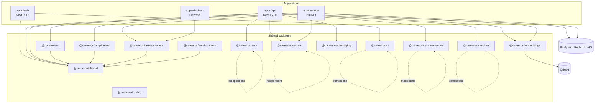

# Codebase Structure

Career OS is a pnpm + Turborepo monorepo with four applications and thirteen shared packages. There is no path-alias indirection: cross-workspace imports use the `@careeros/*` package names declared in each `package.json`; within a workspace imports are relative.

## Core Sections (Required)

### 1) Top-Level Map

| Path | Purpose | Evidence |
|------|---------|----------|
| `apps/web/` | Next.js 16 App Router user app (47 pages): setup wizard, dashboard, arena, market, jobs, settings | `apps/web/src/app/**/page.tsx`; `apps/web/package.json` |
| `apps/api/` | NestJS HTTP API: 38 feature modules, Prisma data layer, WebSockets gateway, seed data | `apps/api/src/app.module.ts:14-124`; `apps/api/src/modules/` |
| `apps/worker/` | BullMQ workers on Redis (sync, embedding, retention, market snapshot, Gmail watch, selector health, corpus refresh) | `apps/worker/src/main.ts`; `apps/worker/src/*.worker.ts` |
| `apps/desktop/` | Electron desktop companion agent (Playwright + user's Chrome, WSS pairing) | `apps/desktop/src/main.ts`; `apps/desktop/package.json` |
| `packages/ai/` | `AIProvider` abstraction, DeepSeek adapter, versioned prompts, grounding/injection/sensitivity, evals | `packages/ai/src/` |
| `packages/shared/` | Zod schemas, constants, knowledge rules, queues, retry, redact, git-analysis, SSRF guard | `packages/shared/src/` |
| `packages/job-pipeline/` | Source-agnostic job ingestion funnel (adapters + stages) | `packages/job-pipeline/src/` |
| `packages/embeddings/` | Qdrant store wrapper + local (placeholder) embedder | `packages/embeddings/src/` |
| `packages/auth/` | Argon2id hashing + sealed session cookie helpers | `packages/auth/src/` |
| `packages/secrets/` | AES-256-GCM field encryption + master-key validation | `packages/secrets/src/` |
| `packages/browser-agent/` | Agent task contract, YAML allowlist, pacing, kill-switch, selector health | `packages/browser-agent/src/` |
| `packages/email-parsers/` | LinkedIn/Indeed/Naukri alert-HTML parsers | `packages/email-parsers/src/` |
| `packages/resume-render/` | PDF/DOCX resume + cover-letter rendering and templates | `packages/resume-render/src/` |
| `packages/sandbox/` | Docker-per-run code execution with resource/kill limits | `packages/sandbox/src/` |
| `packages/messaging/` | Transport-free `Channel` interface (Slack/Web/WhatsApp/Discord) | `packages/messaging/src/` |
| `packages/ui/` | Design-system primitives, tokens, layout | `packages/ui/src/` |
| `packages/testing/` | Testcontainers harness, MSW handlers, axe, arbitraries | `packages/testing/src/index.ts` |
| `infra/` | Docker Compose, Postgres init, Squid config, Slack manifest | `infra/docker/`, `infra/postgres/`, `infra/slack/` |
| `plan/` | Living implementation plan, per-phase checklists, cross-cutting specs (security, ai-safety, testing, observability, release) | `plan/PLAN.md` and siblings |
| `docs/` | Operator docs + authoritative product blueprint (`.docx`) | `docs/architecture.md`, `docs/*.docx` |
| `careeros-screens/` | 60+ static HTML wireframes (information architecture only, not final design) | `careeros-screens/index.html` |
| `scripts/` | Backup/restore, verification gates, browser-agent probes, smoke tests | `scripts/` |
| `.github/workflows/` | 9 CI/CD workflows | `.github/workflows/` |
| `AGENTS.md` | Durable agent/dev rules for the repo | `AGENTS.md` |

### 2) Entry Points

- **Main runtime entry (API):** `apps/api/src/main.ts` — boots after `startup-check.ts`, registers global `LockoutExceptionFilter`, helmet security middleware, Swagger-less OpenAPI `[TODO]`.
- **Web entry:** `apps/web/src/app/layout.tsx` + `apps/web/src/middleware.ts` (setup-state gate).
- **Worker entry:** `apps/worker/src/main.ts` — pino + Prisma + heartbeat + Qdrant + seed skills + register workers.
- **Desktop entry:** `apps/desktop/src/main.ts` (Electron main process, tray + pairing window).
- **Secondary entry points:** NestJS `AgentGateway` (`apps/api/src/modules/agent/agent.gateway.ts`); scheduled BullMQ repeatables registered in `apps/worker/src/main.ts`; `scripts/backup.sh` / `restore.sh`.
- **How entry is selected:** root `package.json` scripts drive `turbo run dev`; each workspace declares its own `dev`/`start`; API production start runs `prisma migrate deploy` first (`apps/api/package.json:11`).

### 3) Module Boundaries

| Boundary | What belongs here | What must not be here |
|----------|-------------------|------------------------|
| `apps/web` | UI, routing, browser fetch wrapper, middleware gate | Direct imports of adapter/provider packages; server secrets |
| `apps/api` | HTTP/WS controllers, domain services, Prisma access, guards | Long-running batch jobs (those go to worker); provider SDK calls outside `packages/ai` |
| `apps/worker` | BullMQ processors, scheduled jobs, external sync | HTTP request handling |
| `apps/desktop` | Local Playwright execution, keychain, WSS client, OS integration | Server-side business logic; server scraping |
| `packages/*` | Reusable capability with a stable interface | Feature-specific controller/service logic (belongs in `apps/api`) |
| `packages/ai` | Provider abstraction, prompts, grounding/safety | Direct DB access (agents write through domain services) |

Rule from `AGENTS.md` §5: never import an adapter from `apps/web` directly; go through a stable `packages/` interface. Domain logic lives in `apps/api` NestJS modules.

### 4) Naming and Organization Rules

- **File naming:** `kebab-case` for multi-word files (`zod-validation.pipe.ts`, `agent.jwt-strategy.ts`, `market-snapshot.worker.ts`); React components are `PascalCase.tsx` (`SkillTree.tsx`, `ApprovalQueue.tsx`); hooks/utilities are `camelCase.ts` (`useDrafts.ts`, `api-client.ts`).
- **Directory organization:** `apps/api` is module/feature-based (`modules/<feature>/<feature>.controller.ts|service.ts|module.ts`); `apps/web` is route-based under `src/app` and feature-based under `src/components/<feature>/`; `packages` are capability-based with a barrel `src/index.ts`.
- **Bootstrap file inside modules:** modules consistently use `<feature>.module.ts` + `<feature>.controller.ts` + `<feature>.service.ts`, and colocate `<name>.test.ts`.
- **Import aliases:** no custom `paths` alias in `tsconfig.base.json`; `@careeros/*` is the workspace package name; intra-workspace imports are relative (`../..`).
- **Barrel policy:** every package exposes a single `src/index.ts`; `@careeros/shared` additionally exposes subpath exports (`./schemas`, `./constants`, `./redact`, `./retry`, `./net`). `./net` is deliberately excluded from the barrel (`packages/shared/src/index.ts:18-19`).

### 5) Evidence

- `apps/api/src/app.module.ts`, `apps/api/src/main.ts`, `apps/api/src/modules/`
- `apps/web/src/app/`, `apps/web/src/components/`, `packages/ui/src/index.ts`
- `pnpm-workspace.yaml`, `turbo.json`, `packages/*/package.json`, `docs/codebase/.codebase-scan.txt` (DIRECTORY TREE)

## Extended Sections

### Workspace dependency diagram

### Generated vs source boundaries

- Do not document or edit generated output: `dist/`, `.next/`, `apps/*/dist`, `packages/*/dist`, `prisma/generated/`, coverage. `.gitignore` and `.eslintrc.cjs:29-38` both exclude them.
- `apps/api/prisma/migrations/` **is** committed source (38 migration directories) and must be treated as reviewable code (`AGENTS.md` §6).
- The product blueprint `docs/*.docx` is the authoritative *product* spec; `docs/architecture.md` is the maintained integration narrative.

### Empty / not-yet-created paths referenced by config

`[TODO]` Several paths are referenced by scripts, CI, or docs but do not exist in the tree: `infra/nginx/`, `infra/docker/docker-compose.host-dev.yml`, `scripts/dev-host.sh`, `scripts/seed-test.ts`, `packages/ui/src/motion.ts` (re-exported by `packages/ui/src/index.ts`). See `CONCERNS.md`.
